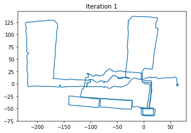
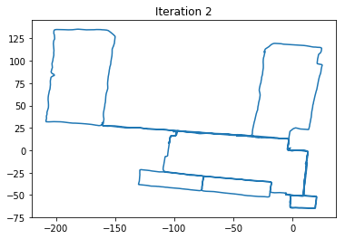
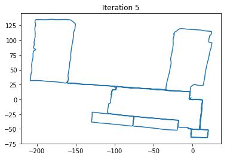

# This repository is...

Jupyter notebook implementation of https://github.com/AtsushiSakai/PythonRobotics

# SLAM

### Graph Based SLAM

Ref: [Graph-Based-SLAM_english.pdf](./SLAM/GraphBasedSLAM/Graph-Based-SLAM_english.pdf)

|  |  |  |
| :---: | :---: | :---: |
|  |  |  |

# Localization

### Extended Kalman Filter

|  |  |  |
| :---: | :---: | :---: |
|  |  |  |

### Unscented Kalman Filter

|  |  |  |
| :---: | :---: | :---: |
|  |  |  |

### Particle Filter

|  |  |  |
| :---: | :---: | :---: |
|  |  |  |

# Path planning

### RRT

|  |  |  |
| :---: | :---: | :---: |
|  |  |  |

### RRT*

|  |  |  |
| :---: | :---: | :---: |
|  |  |  |

### Dijkstra

|  |  |  |
| :---: | :---: | :---: |
|  |  |  |

### A*

|  |  |  |
| :---: | :---: | :---: |
|  |  |  |
